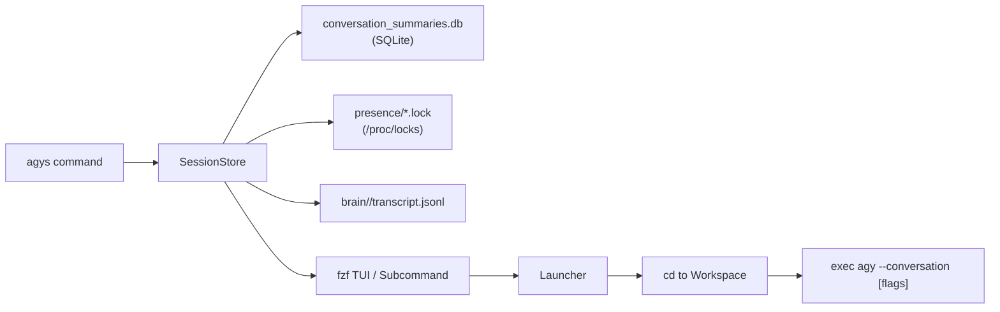

# ⚡ agy-sessions (`agys`)

[](LICENSE)
[](https://www.python.org/downloads/)
[](https://github.com/kdrai512/agy-sessions)
[](pyproject.toml)

> **Interactive TUI session manager for Google Antigravity (`agy`) CLI.**  
> Seamlessly browse, search, inspect, and resume past or active agent conversations with instant execution mode switching (**Safe**, **Unsafe**, **Sandbox**) and automatic workspace navigation.

---

```text
 ╭─────────────────────────────────────────────────────────────────────────────────────────────────╮
 │  🟢  1 │ 3ffa82ad │ just now │ 163 steps │ Load Previous Conversation     │ ~/Work/tries/agy    │
 │  ⚪  2 │ 2a0fea06 │ 28m ago  │ 343 steps │ Managing Background Docker ... │ ~/Work/tries/agy    │
 │  ⚪  3 │ bfb43505 │ 31m ago  │  28 steps │ Accessing Previous Chat His... │ ~/Work              │
 │  ⚪  4 │ caefa9c3 │ 57m ago  │  85 steps │ Uninstall Codex From Omarchy   │ ~/Work              │
 ╰─────────────────────────────────────────────────────────────────────────────────────────────────╯
  [ENTER: Action Menu]  [^U: Unsafe Mode]  [^S: Safe Mode]  [^B: Sandbox]  [^T: Transcript]  [^K: Kill]
```

---

## 🚀 Why `agy-sessions`?

Google Antigravity (`agy`) is an agentic coding assistant, but managing multiple parallel sessions, recalling past conversation IDs, or toggling between guarded execution and automated pipelines can be tedious:

1. **No Session Amnesia**: Instantly fuzzy-search through all past conversations by title, keyword, ID, or workspace.
2. **Live Side-by-Side Preview**: Read the last 10 conversation turns, user prompts, agent summaries, and tool calls directly in your terminal before resuming.
3. **Execution Mode Flexibility**: Choose whether to run with guarded tool permissions (**Safe Mode**), automated headless execution (**Unsafe Mode** via `--dangerously-skip-permissions`), or restricted container isolation (**Sandbox Mode**).
4. **Auto-Workspace Navigation**: `agys` reads the session's original workspace path and automatically `cd`s to it prior to resuming, guaranteeing git roots, relative paths, and local configs remain consistent.
5. **Real-Time Lock & Process Tracking**: Detects active vs idle sessions using Linux advisory locks (`/proc/locks`), identifies holding PIDs, and allows one-click termination of runaway tasks.
6. **Zero External Dependencies**: Built entirely with Python's standard library. Works out of the box on any system with Python 3.8+.

---

## 📦 Installation

### Option 1: One-Liner (Recommended)

```bash
curl -fsSL https://raw.githubusercontent.com/kdrai512/agy-sessions/main/install.sh | bash
```

### Option 2: Using `pipx` or `uv`

```bash
# Using pipx
pipx install git+https://github.com/kdrai512/agy-sessions.git

# Using uv
uv tool install git+https://github.com/kdrai512/agy-sessions.git
```

### Option 3: Manual Clone

```bash
git clone https://github.com/kdrai512/agy-sessions.git
cd agy-sessions
mkdir -p ~/.local/bin
cp bin/agy-sessions ~/.local/bin/agy-sessions
ln -sf ~/.local/bin/agy-sessions ~/.local/bin/agys
chmod +x ~/.local/bin/agy-sessions
```

> **Note**: Ensure `~/.local/bin` is in your `$PATH`.

---

## 🎮 Interactive TUI

Simply run:

```bash
agys
# or
agy-sessions
```

If [`fzf`](https://github.com/junegunn/fzf) is installed on your system, `agys` launches an interactive fuzzy selector with a rich split-pane preview window displaying full metadata and conversation dialogue. If `fzf` is not present, it gracefully falls back to a clean numbered terminal menu.

### ⌨️ Speed Keybindings in `fzf`

| Key | Action |
| :--- | :--- |
| **`Enter`** | Open interactive action menu (Safe / Unsafe / Sandbox / Transcript / Delete) |
| **`Ctrl + U`** | Directly resume in **⚡ Unsafe Mode** (`--dangerously-skip-permissions`) |
| **`Ctrl + S`** | Directly resume in **🛡️ Safe Mode** (prompts for tool approvals) |
| **`Ctrl + B`** | Directly resume in **📦 Sandbox Mode** (`--sandbox`) |
| **`Ctrl + T`** | Open full formatted dialogue transcript in system pager (`bat` / `less`) |
| **`Ctrl + K`** | Terminate active running session process (`SIGTERM`) |
| **`Ctrl + D`** | Delete / archive session from database |
| **`ESC`** | Exit picker |

---

## 🛠️ CLI Subcommands

`agys` can also be driven entirely from scripts or terminal subcommands:

### 1. List Sessions

```bash
# List top 20 recent sessions
agys list

# Limit results
agys list -n 5
```

Output:
```text
#   STATUS   ID         UPDATED    STEPS  TITLE                                  WORKSPACE
─────────────────────────────────────────────────────────────────────────────────────────────────────────
1   ACTIVE   3ffa82ad   4m ago     163    Load Previous Conversation             ~/Work/tries/2026-09-03-agy-sandbox
2   IDLE     2a0fea06   28m ago    343    Managing Background Docker Processes   ~/Work/tries/2026-09-03-agy-sandbox
3   IDLE     bfb43505   30m ago    28     Accessing Previous Chat History        ~/Work
4   IDLE     caefa9c3   55m ago    85     Uninstall Codex From Omarchy           ~/Work
```

### 2. View Active Sessions

```bash
agys active
```

Output:
```text
Active Antigravity Sessions (1):

  ● 3ffa82ad (PID 863194) │ 4m ago │ 163 steps │ Load Previous Conversation
    Workspace: ~/Work/tries/2026-09-03-agy-sandbox
```

### 3. Resume a Session

You can target sessions by **1-based index**, **short ID**, **full UUID**, or **title keyword**:

```bash
# Resume session #2 in Safe Mode (default)
agys resume 2

# Resume in Unsafe Mode (auto-approves tool execution)
agys resume 2 -u

# Resume in Sandbox Mode
agys resume 2 -b

# Resume in a new Omarchy/terminal window
agys resume 2 -w

# Search by keyword
agys resume docker -u
```

### 4. Inspect Full Transcript

```bash
# View detailed transcript and turns in pager
agys info 2a0fea06
```

### 5. Terminate / Delete Sessions

```bash
# Kill a stuck or running session
agys kill 1

# Delete / archive a session
agys delete caefa9c3
```

---

## ⚙️ How It Works



1. **Storage Engine**: Queries Antigravity's internal SQLite database (`~/.gemini/antigravity-cli/conversation_summaries.db`) and supplements it with `conversations/*.db` and `history.jsonl`.
2. **Presence & Lock Detection**: Inspects advisory FLOCK locks in `~/.gemini/antigravity-cli/presence/*.lock` and correlates with `/proc/locks` and `/proc/*/fd` to discover live process PIDs.
3. **Transcript Parser**: Streams `transcript.jsonl` from the agent's brain directory, stripping metadata envelopes and extracting readable user requests, assistant answers, and tool calls (`run_command`, `view_file`, etc.).
4. **Workspace Preservation**: Extracts `workspace_uris`, unescapes `file://` URIs, and changes working directory before invoking `agy`.

---

## 🐚 Shell Completions

Pre-built shell completions are included in the `completions/` directory:

### Bash
```bash
cp completions/agy-sessions.bash ~/.local/share/bash-completion/completions/agy-sessions
# or source it in ~/.bashrc:
source /path/to/completions/agy-sessions.bash
```

### Zsh
```bash
cp completions/agy-sessions.zsh ~/.zsh/completion/_agy-sessions
# Ensure fpath includes ~/.zsh/completion in ~/.zshrc
```

### Fish
```bash
cp completions/agy-sessions.fish ~/.config/fish/completions/agy-sessions.fish
```

---

## 🤝 Contributing

Contributions, feature suggestions, and bug reports are welcome!
1. Fork the repository
2. Create your feature branch (`git checkout -b feature/amazing-feature`)
3. Run tests: `python3 -m unittest discover -s tests`
4. Commit your changes (`git commit -m 'Add amazing feature'`)
5. Push to the branch (`git push origin feature/amazing-feature`)
6. Open a Pull Request

---

## 📄 License

Distributed under the **MIT License**. See [`LICENSE`](LICENSE) for details.

Developed with ❤️ by [Kunjdhari Rai](https://github.com/kdrai512).
