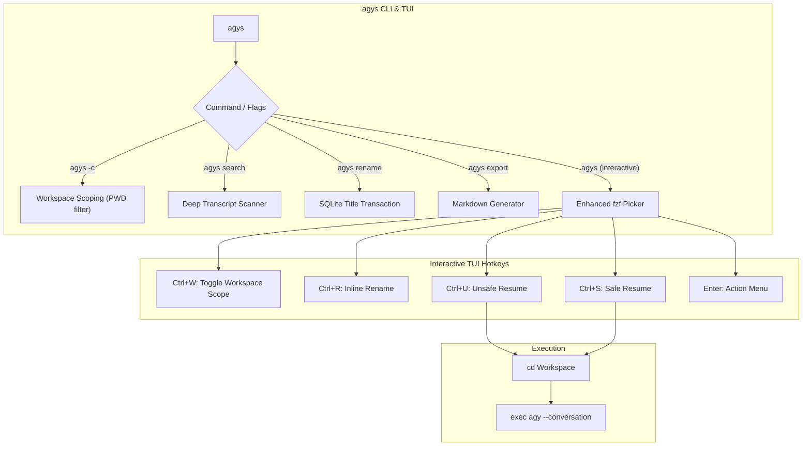

# ⚡ agy-sessions (`agys`)

[](LICENSE)
[](https://www.python.org/downloads/)
[](https://github.com/kdrai512/agy-sessions)
[](pyproject.toml)

> **Interactive TUI & CLI session manager for Google Antigravity (`agy`).**  
> Seamlessly browse, search, inspect, rename, export, and resume past or active agent conversations with instant execution mode switching (**Safe**, **Unsafe**, **Sandbox**), deep transcript search, and automatic workspace navigation.

---

```text
 ╭─────────────────────────────────────────────────────────────────────────────────────────────────╮
 │  🟢  1 │ 3ffa82ad │ just now │ 163 steps │ Load Previous Conversation     │ ~/Work/tries/agy    │
 │  ⚪  2 │ 2a0fea06 │ 28m ago  │ 343 steps │ Managing Background Docker ... │ ~/Work/tries/agy    │
 │  ⚪  3 │ bfb43505 │ 31m ago  │  28 steps │ Accessing Previous Chat His... │ ~/Work              │
 │  ⚪  4 │ caefa9c3 │ 57m ago  │  85 steps │ Uninstall Codex From Omarchy   │ ~/Work              │
 ╰─────────────────────────────────────────────────────────────────────────────────────────────────╯
  [ENTER: Action Menu]  [^U: Unsafe]  [^S: Safe]  [^B: Sandbox]  [^W: Workspace]  [^R: Rename]  [^T: Details]
```

---

## 🚀 Key Features

1. **No Session Amnesia**: Instantly fuzzy-search through all past conversations by title, keyword, ID, or workspace.
2. **Deep Transcript Search (`agys search <term>`)**: Full-text search across all conversation dialogue, code snippets, tool calls, and commands with turn index and highlighted snippets.
3. **Workspace Scoping (`agys -c` / `Ctrl+W`)**: Filter conversations to your current project directory, or toggle dynamically between *Current Workspace* and *All Workspaces* in `fzf`.
4. **Session Renaming (`agys rename` / `Ctrl+R`)**: Edit auto-generated titles directly in SQLite storage and the interactive TUI.
5. **Markdown Transcript Export (`agys export`)**: Export any session into clean GitHub-flavored Markdown with collapsible `<details>` blocks for tool executions.
6. **Execution Mode Flexibility**: Choose whether to run with guarded tool permissions (**Safe Mode**), automated headless execution (**Unsafe Mode** via `--dangerously-skip-permissions`), or isolated container execution (**Sandbox Mode**).
7. **Live Side-by-Side Preview & Model Badges**: View active model badges (e.g. `🔮 Gemini 3.8 Flash (High)`), conversation dialogue, user prompts, and tool calls before resuming.
8. **Auto-Workspace Navigation**: Automatically switches working directories to the session's workspace before resuming, ensuring git branches, relative paths, and env vars are aligned.
9. **Desktop Spotlight Integration**: Integrates with Hyprland and Omarchy (`SUPER + A`) as a centered, floating modal window.
10. **Zero External Dependencies**: 100% pure Python standard library. No `pip install` required.

---

## 📦 Installation

### Option 1: One-Liner (Recommended)

```bash
curl -fsSL https://raw.githubusercontent.com/kdrai512/agy-sessions/main/install.sh | bash
```

### Option 2: Using `pipx` or `uv`

```bash
# Using pipx
pipx install git+https://github.com/kdrai512/agy-sessions.git

# Using uv
uv tool install git+https://github.com/kdrai512/agy-sessions.git
```

### Option 3: Manual Clone

```bash
git clone https://github.com/kdrai512/agy-sessions.git
cd agy-sessions
mkdir -p ~/.local/bin
cp bin/agy-sessions ~/.local/bin/agy-sessions
ln -sf ~/.local/bin/agy-sessions ~/.local/bin/agys
chmod +x ~/.local/bin/agy-sessions
```

> **Note**: Ensure `~/.local/bin` is in your `$PATH`.

---

## 🎮 Interactive TUI

Simply run:

```bash
agys
# or scoped to current directory
agys -c
```

If [`fzf`](https://github.com/junegunn/fzf) is installed, `agys` launches an interactive fuzzy selector with a rich split-pane preview window displaying full metadata and conversation dialogue. If `fzf` is not present, it gracefully falls back to a clean numbered terminal menu.

### ⌨️ Speed Keybindings in `fzf`

| Key | Action |
| :--- | :--- |
| **`Enter`** | Open action submenu (Safe / Unsafe / Sandbox / Details / Rename / Export / Delete) |
| **`Ctrl + U`** | Directly resume in **⚡ Unsafe Mode** (`--dangerously-skip-permissions`) |
| **`Ctrl + S`** | Directly resume in **🛡️ Safe Mode** (prompts for tool approvals) |
| **`Ctrl + B`** | Directly resume in **📦 Sandbox Mode** (`--sandbox`) |
| **`Ctrl + W`** | **Toggle Workspace Scope** (switch between current directory and all projects) |
| **`Ctrl + R`** | **Rename Session Title** (inline edit stored in SQLite) |
| **`Ctrl + T`** | Open full formatted dialogue transcript in system pager (`bat` / `less`) |
| **`Ctrl + K`** | Terminate active running session process (`SIGTERM`) |
| **`Ctrl + D`** | Delete / archive session from database |
| **`ESC`** | Exit picker |

---

## 🛠️ CLI Subcommands

`agys` can be driven entirely from scripts or terminal subcommands:

### 1. List Sessions

```bash
# List top 25 recent sessions
agys list

# Filter only to current project workspace
agys list -c

# Limit results
agys list -n 5
```

### 2. Deep Transcript Search

Search inside conversation transcripts, user prompts, agent thoughts, and tool executions:

```bash
# Search across all sessions
agys search "AppLibrary"

# Limit results
agys search "docker" -n 5

# Search only within current workspace
agys search "hyprland" -c

# Search and interactively prompt to resume
agys search "nginx" -r
```

### 3. Rename a Session

```bash
# Rename by index, short ID, or UUID
agys rename 1 "Docker Engine Cleanup & Setup"
agys rename 2a0fea06 "Omarchy Menu Fixes"
```

### 4. Export to Markdown

Export complete dialogue transcripts with collapsible `<details>` blocks for tool executions:

```bash
# Export session #1 to ./<title-slug>.md
agys export 1

# Export to a custom path
agys export 2a0fea06 ~/Documents/session-notes.md

# Pipe Markdown directly to glow or pager
agys export 1 --stdout | glow -
```

### 5. Resume a Session

Target sessions by **1-based index**, **short ID**, **full UUID**, or **title keyword**:

```bash
# Resume session #2 in Safe Mode (default)
agys resume 2

# Resume in Unsafe Mode (auto-approves tool execution)
agys resume 2 -u

# Resume in Sandbox Mode
agys resume 2 -b

# Resume in a new Omarchy/terminal window
agys resume 2 -w

# Search by keyword
agys resume docker -u
```

### 6. View Active Sessions & Kill

```bash
# Show active sessions and holding PIDs
agys active

# Kill a running session
agys kill 1
```

---

## 🖥️ Hyprland Desktop Integration (Spotlight Window)

To bind `agys` to `SUPER + A` as a centered, floating spotlight window (Raycast-style):

1. Add the keybinding in `~/.config/hypr/bindings.lua`:
   ```lua
   o.bind("SUPER + A", "Antigravity Sessions", { tui = "agys" })
   ```

2. Add the window rule in `~/.config/hypr/hyprland.lua`:
   ```lua
   o.window("org.omarchy.agys", {
     float = true,
     center = true,
     size = { 1150, 680 },
   })
   ```

3. Reload Hyprland:
   ```bash
   hyprctl reload && hyprctl configerrors
   ```

---

## ⚙️ How It Works



---

## 🐚 Shell Completions

Pre-built shell completions are included in `completions/`:

### Bash
```bash
cp completions/agy-sessions.bash ~/.local/share/bash-completion/completions/agy-sessions
```

### Zsh
```bash
cp completions/agy-sessions.zsh ~/.zsh/completion/_agy-sessions
```

### Fish
```bash
cp completions/agy-sessions.fish ~/.config/fish/completions/agy-sessions.fish
```

---

## 🤝 Contributing

Contributions, feature suggestions, and bug reports are welcome!
1. Fork the repository
2. Create your feature branch (`git checkout -b feature/amazing-feature`)
3. Run tests: `python3 -m unittest discover -s tests`
4. Commit your changes (`git commit -m 'Add amazing feature'`)
5. Push to the branch (`git push origin feature/amazing-feature`)
6. Open a Pull Request

---

## 📄 License

Distributed under the **MIT License**. See [`LICENSE`](LICENSE) for details.

Developed with ❤️ by [Kunjdhari Rai](https://github.com/kdrai512).
